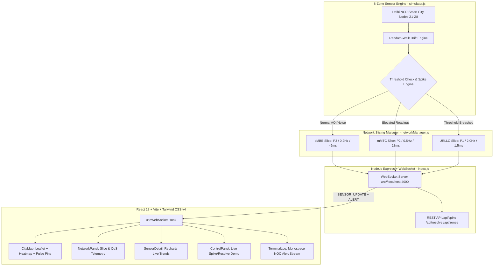

# NetBlizzard

### Environmental & Pollution Monitoring Network over 5G/6G

**PROTOWAVE 2026 — From Prompt to Prototype**  
_Theme 7: 5G/6G-Enabled Smart City Communication and Monitoring_  
_Prototype 4: Environmental & Pollution Monitoring Network over 5G/6G_  
_Department of Networking and Communications | School of Computing | SRM-IST_

---

## Executive Summary & Problem Statement

Modern smart cities require real-time atmospheric and acoustic environmental sensing to protect public health. However, streaming dense environmental telemetry from thousands of city-wide sensor nodes constantly strains wireless spectrum and energy budgets.

**NetBlizzard** implements an intelligent **5G/6G adaptive telemetry network**:

- Under **normal conditions**, sensor nodes transmit periodic telemetry at conservative frequencies using standard broadband channels (**eMBB** / **mMTC**), preserving network resources.
- When an air quality or acoustic threshold breach occurs (e.g., AQI > 150, PM2.5 > 55 ug/m3, or Noise > 80 dB), the network automatically provisions an **Ultra-Reliable Low-Latency Communication (URLLC)** slice.
- Transmission rate dynamically accelerates from **0.2 Hz (5 s) -> 2.0 Hz (500 ms)**, network latency drops from ~45 ms -> 1-2 ms, and data packets receive Critical Priority (P1) QoS treatment.

---

## 5G/6G Telemetry & Networking Concepts Simulated

| Feature                  | Safe State (Normal)                  | Warning State (Elevated)              | Danger / Spiked State (Emergency)                 |
| :----------------------- | :----------------------------------- | :------------------------------------ | :------------------------------------------------ |
| **Network Slice**        | **eMBB** (Enhanced Mobile Broadband) | **mMTC** (Massive Machine-Type Comms) | **URLLC** (Ultra-Reliable Low-Latency)            |
| **QoS Priority**         | `P3` (Low Priority)                  | `P2` (Elevated)                       | `P1` (CRITICAL — Preempts non-urgent traffic)     |
| **Update Frequency**     | 0.2 Hz (every 5000 ms)               | 0.5 Hz (every 2000 ms)                | 2.0 Hz (every 500 ms)                             |
| **Simulated Latency**    | 40-50 ms                             | 15-20 ms                              | **1.0-2.5 ms**                                    |
| **Bandwidth Allocation** | 2-4 Mbps                             | 5-8 Mbps                              | **10-15 Mbps**                                    |
| **Visual Indicator**     | Vivid Green (#1fe090) — Slow breath  | Vivid Amber (#f5c518) — Medium pulse  | Vivid Red (#ff4545) — Rapid alert pulse           |
| **Spiked / Critical**    | —                                    | —                                     | Ultra-Red (#ff1e1e) — Ultra-fast flicker (0.22 s) |

---

## System Architecture



---

## Project Directory Structure

```
NetBlizzard/
├── package.json               # Root scripts (server + client dev)
├── README.md                  # Comprehensive documentation & audit report
├── server/                    # Backend telemetry & 5G/6G slice simulation
│   ├── index.js               # Express HTTP + WebSocket server (port 4000)
│   ├── simulator.js           # 8-zone sensor generator with history buffers
│   ├── networkManager.js      # Slicing, QoS priority, latency & bandwidth logic
│   └── package.json           # Server dependencies (express, ws, cors)
└── client/                    # Frontend NOC / Operations Dashboard
    ├── index.html             # HTML shell with IBM Plex font preloading
    ├── vite.config.js         # Vite configuration with /api reverse proxy
    ├── package.json           # Client dependencies (React, Leaflet, Recharts, Lucide)
    └── src/
        ├── main.jsx           # React root mounting point
        ├── index.css          # Design system, CSS grid, EPA color tokens, animations
        ├── App.jsx            # Main dashboard shell, responsive grid, status bar
        ├── hooks/
        │   └── useWebSocket.js # Real-time state synchronization & reconnect toggle
        └── components/
            ├── CityMap.jsx       # Leaflet map, 2km grid, hex overlay, pulsing markers
            ├── NetworkPanel.jsx  # 5G/6G link telemetry, slice badge, QoS meters
            ├── SensorDetail.jsx  # Recharts live multi-metric charts with threshold lines
            ├── ControlPanel.jsx  # Interactive SPIKE and RESOLVE demo triggers
            └── TerminalLog.jsx   # Monospace NOC alert feed with event level styling
```

---

## Dashboard Feature Tour

### 1. Dominant GIS City Map (CityMap.jsx)

- Dark-filtered OpenStreetMap cartography centered on **Delhi NCR (8 critical zones)**.
- **2-km Coordinate Grid Overlay** simulating professional telecom/NOC map tooling.
- **Hex-approximate Heat Overlay** providing color-graded pollution dispersion (Green -> Yellow -> Orange -> Red).
- **Telemetry Dot Pins** with multi-tier pulsing rings:
  - Safe zones breathe slowly (2.8 s).
  - Warning zones pulse at moderate intervals (1.3 s).
  - Danger zones pulse rapidly (0.55 s).
  - Spiked zones trigger high-intensity double-ring ultra-fast flicker (0.22 s).
- Clickable pins that surface rich interactive tooltips and update sidebars.

### 2. Live Telemetry & 5G/6G Slicing Panel (NetworkPanel.jsx)

- Selected zone coordinate header with high-precision lat/long telemetry.
- Prominent 30 px bold **AQI Index Readout** with EPA classification badge.
- Real-time sensor channels: **AQI**, **PM2.5 (ug/m3)**, **CO2 (ppm)**, and **Noise (dB)**.
- Active **5G/6G Network Slice** card with visual priority rating (P1-P3).
- Real-time link telemetry: simulated latency (ms), update frequency (Hz), reporting interval (ms), and bandwidth (Mbps).

### 3. Real-Time Time-Series Analysis (SensorDetail.jsx)

- Built with high-performance SVG line charts (`Recharts`) with zero interpolation lag.
- Tracks the last 40 data points per zone for all 4 parameters simultaneously.
- Features red dashed **Danger Threshold Reference Lines**; charts dynamically light up with alert badges when thresholds are breached.

### 4. Interactive Spike Simulator (ControlPanel.jsx)

- Allows jury members or presenters to manually inject environmental pollution surges into any zone with a single click.
- Instantly triggers server-side threshold violation, URLLC slice escalation, and terminal alert broadcasts.
- **RESOLVE** restores the zone to ambient equilibrium and downgrades the slice to eMBB.

### 5. Terminal Alert Stream (TerminalLog.jsx)

- Fixed 120 px bottom operations terminal with status accents and blinking shell cursor.
- Formatted log stream tagged with `[CRIT]`, `[WARN]`, and `[ OK ]` severity codes.

### 6. Telecom Status Header (App.jsx)

- Zone distribution counts (Safe, Warning, Critical).
- Telecom-style 4-bar **Signal Strength Meter** dynamically mapped to average network latency.
- Live system clock (HH:MM:SS).
- Interactive **LIVE / OFFLINE Switch** with one-click instant reconnection trigger.

---

## Quick Start Guide

### Prerequisites

- **Node.js**: v18.0.0 or later (tested with Node v24.18.0)
- **Bun**: v1.3.0 or later
- **PowerShell** or another terminal

### Installation

Install dependencies separately for the server and client. Run these commands from the repository root:

```powershell
# Install server dependencies
cd server
bun install

# Install client dependencies
cd ..\client
bun install
```

If Bun is not installed, follow the instructions at https://bun.sh/docs/installation.

### Running the Application

Open two terminals in VS Code (`Ctrl+Shift+` `` ` ``):

**Terminal 1 — Backend Telemetry Server:**

```powershell
cd server
bun start
```

_Server starts on `http://localhost:4000` with WebSocket on `ws://localhost:4000`._

**Terminal 2 — Frontend Operations Dashboard:**

```powershell
cd client
bun run dev
```

_Vite serves the client on `http://localhost:5173`._

Open your web browser and navigate to:
**http://localhost:5173**

### Verification

Check that the backend is running:

```powershell
Invoke-RestMethod http://localhost:4000/api/health
```

Create a production build of the frontend:

```powershell
cd client
bun run build
```

To stop either process, press `Ctrl+C` in its terminal.

---

## Demonstration Script for Hackathon Jury

Follow this sequence to score full marks against the judging rubric:

1. **Orientation (Presentation & Visual Clarity - 5/5):**
   - Explain that **NetBlizzard** is designed as a true NOC / infrastructure tool (inspired by Grafana and PurpleAir), avoiding generic cards and artificial styling.
   - Point out the dark GIS map with the 2-km coordinate grid, EPA-scale AQI swatches, and the live status bar.

2. **5G/6G Concept Explanation (Communication/Networking Integration - 5/5):**
   - Show that under normal baseline, Zone 1 is on an **eMBB** slice with low transmission frequency (0.2 Hz, 5 s interval) and ~45 ms latency to conserve spectrum and battery.

3. **Live Trigger Demonstration (Technical Depth & Prototype Quality - 10/10):**
   - Navigate to the **Control** tab on the right sidebar.
   - Click **`SPIKE`** on **Zone 1 (Central Hub)**.
   - **Observe the immediate cascade:**
     - The map marker and sidebar dot transition to vivid red and begin **flickering at ultra-high frequency** (0.22 s).
     - The network manager auto-upgrades the slice to **URLLC (Ultra-Reliable Low-Latency Communication)**.
     - Telemetry reporting jumps 10x from **0.2 Hz -> 2.0 Hz** (500 ms intervals).
     - Latency plummets to **1.0-2.0 ms**, and priority elevates to **`P1 CRITICAL`**.
     - An alert is pushed instantly into the bottom **Terminal Log**.
   - Switch to the **Charts** tab to show real-time spike curvature breaching the red threshold line.

4. **Recovery & Self-Healing (Feasibility & Completeness - 5/5):**
   - Click **`RESOLVE`** in the Control tab.
   - Show the network autonomously reverting to standard **eMBB** slice and 5 s interval reporting.
   - Demonstrate the **LIVE / OFFLINE** toggle switch in the header.

---

<div align="center">
NetBlizzard (c) 2026 SRM Institute of Science and Technology. Developed for PROTOWAVE 2026.
</div>
